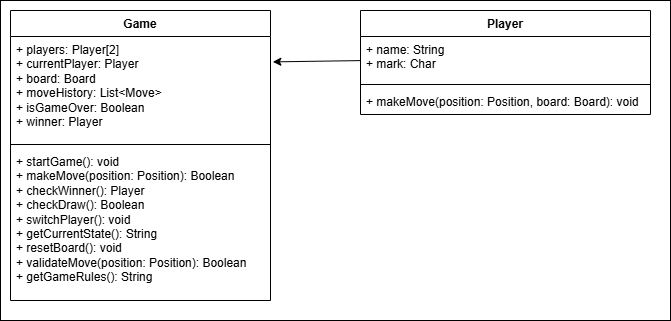

# Design Tic Tac Toe

1) Overview

- Collect all the requirements in this step. 
- Clarify all the requirements. 
- Align with the interviewer regarding the System we want to design.
- Create Class diagram and Schema Diagram
- Code the requirements

2) Requirements For Tic Tac Toe

    * Requirements collected in live class
        - Size of the board can be N x N
        - No of players = N - 1
        - Each player can choose their symbol at the start of the game. Every player should have unique symbol
        - Will there be a bot in the game - Yes
        - How many bots are allowed in per game
            * Only one bot
            * N-2 bots
        - Difficulty level of bots (Easy / Medium / Hard)
        - Who will make the first move
            * at the start of the game, we shall randomize the queue of the players
        - When to stop? When the game ends?
            * When someone wins the game
            * When the game is a draw
        - Undo feature - reverse the last move
            * Global undo button
            * Anyone can press the button any no of time

    * Requirements stated in class assignments
        - There should be two players in the game: 'X' and 'O'.
        - The board should have 3x3 cells.
        - Players take alternate turns to place their marks on the board.
        - A player can place their mark only on an unoccupied cell.
        - The game should be able to identify and announce thewinner (if there is one) or if the game is a draw.
        - The game should be able to display the current state of the board.
        - The game should have the ability to reset the board for a new game.
        - There should be methods to validate the move.
        - The game should maintain the history of moves.
        - Players should be able to query the game's rules.
	
3) Draw Class Diagram and Schema Diagram

    * As per stated in class assignments
    
    